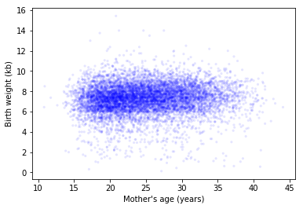
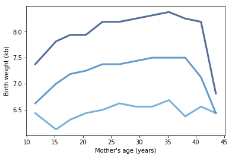
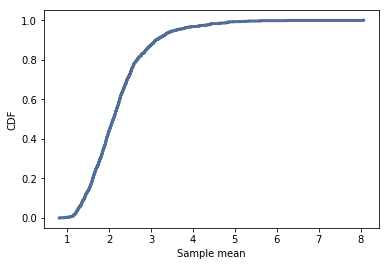
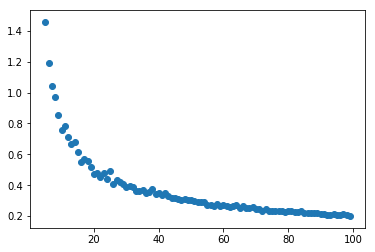
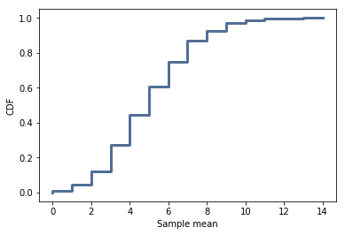
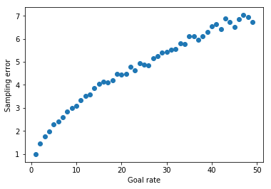

# Statistics

# Table of Contents

[1. Introduction](#section-a)  
[2. Why We Are Using Think Stats](#section-b)  
[3. Instructions for Cloning the Repo](#section-c)  
[4. Required Exercises](#section-d)  
[5. Optional Exercises](#section-e)  
[6. Recommended Reading](#section-f)  
[7. Resources](#section-g)

## <a name="section-a"></a>1.  Introduction

[](http://greenteapress.com/thinkstats2/)

Use Allen Downey's [Think Stats (second edition)](http://greenteapress.com/thinkstats2/) book for getting up to speed with core ideas in statistics and how to approach them programmatically. This book is available online, or you can buy a paper copy if you would like.

Use this book as a reference when answering the 6 required statistics questions below.  The Think Stats book is approximately 200 pages in length.  **It is recommended that you read the entire book, particularly if you are less familiar with introductory statistical concepts.**

Complete the following exercises along with the questions in this file. Some can be solved using code provided with the book. The preface of Think Stats [explains](http://greenteapress.com/thinkstats2/html/thinkstats2001.html#toc2) how to use the code.  

Communicate the problem, how you solved it, and the solution, within each of the following [markdown](https://guides.github.com/features/mastering-markdown/) files. (You can include code blocks and images within markdown.)

## <a name="section-b"></a>2.  Why We Are Using Think Stats 

The stats exercises have been chosen to introduce/solidify some relevant statistical concepts related to data science.  The solutions for these exercises are available in the [ThinkStats repository on GitHub](https://github.com/AllenDowney/ThinkStats2).  You should focus on understanding the statistical concepts, python programming and interpreting the results.  If you are stuck, review the solutions and recode the python in a way that is more understandable to you. 

For example, in the first exercise, the author has already written a function to compute Cohen's D.  **You could import it, or you could write your own code to practice python and develop a deeper understanding of the concept.** 

Think Stats uses a higher degree of python complexity from the python tutorials and introductions to python concepts, and that is intentional to prepare you for the bootcamp.  

**One of the skills to learn here is to understand other people’s code.  And this author is quite experienced, so it’s good to learn how functions and imports work.**

---

## <a name="section-c"></a>3.  Instructions for Cloning the Repo 
Using the [code referenced in the book](https://github.com/AllenDowney/ThinkStats2), follow the step-by-step instructions below.  

**Step 1. Create a directory on your computer where you will do the prework.  Below is an example:**

```
(Mac):      /Users/yourname/ds/metis/metisgh/prework  
(Windows):  C:/ds/metis/metisgh/prework
```

**Step 2. cd into the prework directory.  Use GitHub to pull this repo to your computer.**

```
$ git clone https://github.com/AllenDowney/ThinkStats2.git
```

**Step 3.  Put your ipython notebook or python code files in this directory (that way, it can pull the needed dependencies):**

```
(Mac):     /Users/yourname/ds/metis/metisgh/prework/ThinkStats2/code  
(Windows):  C:/ds/metis/metisgh/prework/ThinkStats2/code
```

---


## <a name="section-d"></a>4.  Required Exercises

*Include your Python code, results and explanation (where applicable).*

### Q1. [Think Stats Chapter 2 Exercise 4](statistics/2-4-cohens_d.md) (effect size of Cohen's d)  
Cohen's D is an example of effect size.  Other examples of effect size are:  correlation between two variables, mean difference, regression coefficients and standardized test statistics such as: t, Z, F, etc. In this example, you will compute Cohen's D to quantify (or measure) the difference between two groups of data.   

You will see effect size again and again in results of algorithms that are run in data science.  For instance, in the bootcamp, when you run a regression analysis, you will recognize the t-statistic as an example of effect size.

### _Question:_

Using the variable totalwgt_lb, investigate whether first babies are lighter or heavier than others. Compute Cohen’s d to quantify the difference between the groups. How does it compare to the difference in pregnancy length?

### _Answer:_

I used the code block below to investigate the question.

```python
# Compute and display summary statisticss for each group
display(firsts['totalwgt_lb'].describe(), 
        others['totalwgt_lb'].describe())

# Compute and display Cohen's effect size
print('Cohen\'s effect size: ', CohenEffectSize(firsts['totalwgt_lb'], others['totalwgt_lb']))
```

### Summary stats for weights of firstborn and other children:

#### Firstborn

```
count    4363.000000
mean        7.201094
std         1.420573
min         0.125000
25%         6.437500
50%         7.312500
75%         8.000000
max        15.437500
Name: totalwgt_lb, dtype: float64
```

#### Other

```
count    4675.000000
mean        7.325856
std         1.394195
min         0.562500
25%         6.500000
50%         7.375000
75%         8.187500
max        14.000000
Name: totalwgt_lb, dtype: float64
```

Just looking at the summary statistics, we can see that firstborn children are roughly 0.125 lbs lighter than their future siblings, on average. That's a pretty small number compared to means > 7 and standard deviations around 1.4. Quantifying that with Cohen's _d_:

#### Cohen's effect size

```
Cohen's effect size:  -0.088672927072602
```

A _d_ of ~0.089 indicates that the effect size here is about three times a large as with pregnancy length. However, it remains true that this is a pretty small effect size. Cohen suggests that effect sizes smaller than 0.2 are trivial.

### Q2. [Think Stats Chapter 3 Exercise 1](statistics/3-1-actual_biased.md) (actual vs. biased)
This problem presents a robust example of actual vs biased data.  As a data scientist, it will be important to examine not only the data that is available, but also the data that may be missing but highly relevant.  You will see how the absence of this relevant data will bias a dataset, its distribution, and ultimately, its statistical interpretation.

### _Question:_

Something like the class size paradox appears if you survey children and ask how many children are in their family. Families with many children are more likely to appear in your sample, and families with no children have no chance to be in the sample. Use the NSFG respondent variable NUMKDHH to construct the actual distribution for the number of children under 18 in the household. Now compute the biased distribution we would see if we surveyed the children
and asked them how many children under 18 (including themselves) are in their household. Plot the actual and biased distributions, and compute their means. As a starting place, you can use chap03ex.ipynb.

### _Answer:_

I used the code block below to investigate the question.

```python
# Read in data
resp = nsfg.ReadFemResp()

# Compute actual pmf and print mean
actual_pmf = thinkstats2.Pmf(resp['numkdhh'], label='actual')
print('Actual mean: ', actual_pmf.Mean())

# Define function to compute biased pmf
def bias_pmf(pmf, label):
    new_pmf = pmf.Copy(label=label)
    for x, p in pmf.Items():
        new_pmf.Mult(x, x)
    new_pmf.Normalize()
    return new_pmf

# Compute biased pmf and print mean
biased_pmf = bias_pmf(actual_pmf, label='observed')    
print('Biased mean: ', biased_pmf.Mean())

# Plot actual and biased distributions
thinkplot.PrePlot(2)
thinkplot.Pmfs([actual_pmf, biased_pmf])
thinkplot.Show(xlabel='# of kids', ylabel='Probability')
```

#### Results

```
Actual mean:  1.024205155043831
Biased mean:  2.403679100664282
```


### Q3. [Think Stats Chapter 4 Exercise 2](statistics/4-2-random_dist.md) (random distribution)  
This questions asks you to examine the function that produces random numbers.  Is it really random?  A good way to test that is to examine the pmf and cdf of the list of random numbers and visualize the distribution.  If you're not sure what pmf is, read more about it in Chapter 3. 

### _Question:_

This questions asks you to examine the function that produces random numbers. Is it really random? A good way to test that is to examine the pmf and cdf of the list of random numbers and visualize the distribution. If you're not sure what pmf is, read more about it in Chapter 3.

The numbers generated by random.random are supposed to be uniform between 0 and 1; that is, every value in the range should have the same probability.
Generate 1000 numbers from random.random and plot their PMF and CDF.
Is the distribution uniform?

### _Answer:_

I used the code block below to investigate the question.

```python
import numpy as np
rand_nums = np.random.random(1000)
rand_pmf = thinkstats2.Pmf(rand_nums)

# Plot PMF of 1000 random numbers betwen 0 and 1
thinkplot.Hist(rand_pmf, width=0.0025)
thinkplot.Config(xlabel='Num', ylabel='Probability')
```


While the PMF gives the appearance of a uniform distribution, it's clear that how it's displayed is hugely dependent on the width of the bins. The default value will make the PMF render as if there's no data at all, and choices between 0.001 and 0.01 are suggestive of a uniform distribution but leave a lot to be desired. Let's check out the CDF. 

```python
rand_cdf = thinkstats2.Cdf(rand_nums)

# Plot CDF of 1000 random numbers betwen 0 and 1
thinkplot.Cdf(rand_cdf)
thinkplot.Config(xlabel='Num', ylabel='Probability')
```


Based on how linear the cdf is, it's fair to say that the distribution of random numbers is quite uniform. 

### Q4. [Think Stats Chapter 5 Exercise 1](statistics/5-1-blue_men.md) (normal distribution of blue men)
This is a classic example of hypothesis testing using the normal distribution.  The effect size used here is the Z-statistic. 

### _Question:_

In the BRFSS (see Section 5.4), the distribution of heights is roughly normal with parameters µ = 178 cm and σ = 7.7 cm for men, and µ = 163 cm and σ = 7.3 cm for women. In order to join Blue Man Group, you have to be male between 5’10” and 6’1” (see http://bluemancasting.com). What percentage of the U.S. male population is in this range? Hint: use scipy.stats.norm.cdf.

### _Answer:_

I used the code block below to investigate the question.

```python
import scipy.stats

# Generate normal distribution of heights for men with parameters from BRFSS
mu = 178
sigma = 7.7
dist = scipy.stats.norm(loc=mu, scale=sigma)

# Define lower and upper bounds
lower_in = 70
upper_in = 73

# Convert to cm
lower = lower_in * 2.54
upper = upper_in * 2.54

# Calculate percentiles for each to determine probability between threshholds
lower_perc = dist.cdf(lower)
upper_perc = dist.cdf(upper)
prob_between = upper_perc - lower_perc

print(prob_between)
```

#### Results

```
0.34274683763147457
```

Based on the mean and standard deviation reported by this data, approximately 34.3% of adult males are between 5'10" and 6'1".

### Q5. Bayesian (Elvis Presley twin) 

Bayes' Theorem is an important tool in understanding what we really know, given evidence of other information we have, in a quantitative way.  It helps incorporate conditional probabilities into our conclusions.

Elvis Presley had a twin brother who died at birth.  What is the probability that Elvis was an identical twin? Assume we observe the following probabilities in the population: fraternal twin is 1/125 and identical twin is 1/300.  

### _Answer:_

Let's say that:

- $P(T)$ represents the probability that a person is a twin
- $P(F)$ represents the probability that a person is a fraternal twin; 1/125
- $P(I)$ represents the probability that a person is an identical twin; 1/300

Had we no prior information, we'd say that the probability Elvis was an identical twin is 1/300. However, given that we already know that Elvis was _some kind_ of twin, we can narrow down that probability a little bit. This is where Bayes' theorem comes in. We're looking for the probability that Elvis was an identical twin, _given that we know he was a twin_, or $P(I | T)$. According to Bayes' theorem:

​	$P(I | T) = \frac {P(T | I)  P(I)}{P(T)}​$

$P(T)$ is simply the sum of $P(I)$ and $P(F)$,

​	$\Rightarrow P(T) = P(I) + P(F) = 1/125 + 1/300 = 17/1500$

Since an identical twin is inherently a twin, $P(T | I) = 1$. Therefore we can say:

​	$P(I | T) = \frac {P(T | I)  P(I)}{P(T)} = \frac {P(I)} {P(T)} = \frac {1/300} {17/1500} = \frac 5 {17}$

```
Thus, the probability that Elvis was an identical twin was 5/17, or ~29.4%.
```

---

### Q6. Bayesian &amp; Frequentist Comparison  
How do frequentist and Bayesian statistics compare?

### _Answer:_

Frequentist and Bayesian statistics are fundamentally different perpectives on the meaning of probability. By the frequentist definition, you can only calculate the probability of a repeatable random event, such as flipping a coin or drawing a red marble from a bag of mixed colors of marbles. This does not extend well to non-repeatable events, such as the probability that Arnold Schwarzenegger would defeat Dwayne 'The Rock' Johnson in a footrace. Bayesian statistics, however, allow you to represent the uncertainty of any event or hypothesis and makes use of prior knowledge to calculate new probability estimates. Whether or not you can use probability distributions over possible values of a parameter on which you have prior knowledge to calculate additional probability estimates of nonrandom/repeatable events is the divisive difference between the two schools.

---

## <a name="section-e"></a>5.  Optional Exercises

The following exercises are optional, but we highly encourage you to complete them if you have the time.

### Q7. [Think Stats Chapter 7 Exercise 1](statistics/7-1-weight_vs_age.md) (correlation of weight vs. age)
In this exercise, you will compute the effect size of correlation.  Correlation measures the relationship of two variables, and data science is about exploring relationships in data.    

### _Question:_

Using data from the NSFG, make a scatter plot of birth weight versus mother’s age. Plot percentiles of birth weight versus mother’s age. Compute Pearson’s and Spearman’s correlations. How would you characterize the relationship between these variables?

### _Answer:_

#### Scatterplot of birth weight vs mother's age:

```python
import first

live, firsts, others = first.MakeFrames()
live = live.dropna(subset=['agepreg', 'totalwgt_lb'])
mother_age = live['agepreg']
birth_weight = live['totalwgt_lb']
thinkplot.Scatter(mother_age, birth_weight, alpha=0.1, s=10)
thinkplot.Config(xlabel='Mother\'s age (years)',
                 ylabel='Birth weight (kb)',
                 legend=False)
```



#### Percentiles of birth weight vs mother's age:

```python
# Divide the dataset into groups by mother's age
bins = np.arange(10, 45, 3)
indices = np.digitize(live['agepreg'], bins)
groups = live.groupby(indices)

# Compute the CDF of weight within each group
mean_ages = [group['agepreg'].mean() for i, group in groups]
cdfs = [thinkstats2.Cdf(group['totalwgt_lb']) for i, group in groups]

# Extract and plot the 25th, 50th, and 75th percentile from each group
for percent in [75, 50, 25]:
    weight_percentiles = [cdf.Percentile(percent) for cdf in cdfs]
    label = '%dth' % percent
    thinkplot.Plot(mean_ages, weight_percentiles, label=label)
    
thinkplot.Config(xlabel='Mother\'s age (years)',
                 ylabel='Birth weight (kb)',
                 legend=False)
```



#### Pearson's correlation of birth weight vs mother's age:

```python
Corr(mother_age, birth_weight)
```

```
0.06883397035410908
```

#### Spearman's correlation of birth weight vs mother's age:

```python
SpearmanCorr(mother_age, birth_weight)
```

```
0.09461004109658226
```

#### Conclusion:

Going off just the scatter plot, we can see that mother's age and child's birth weight are nearly independent. Looking at a percentile plot, here binned at 3 years per group and showing the 25th, 50th, and 75th percentiles, we can see what appears to be a slight upward trend of increasing birth weight as a mother gets older until a there's a relatively sharp drop around age 40. Our correlation factors back up this observation in that both are positive, but only slightly. The Spearman correlation is slightly higher than the Pearson correlation, possibly due to some nonlinearity, skew, or outliers in the data that Pearson's method does not handle quite as well.

### Q8. [Think Stats Chapter 8 Exercise 2](statistics/8-2-sampling_dist.md) (sampling distribution)
In the theoretical world, all data related to an experiment or a scientific problem would be available.  In the real world, some subset of that data is available.  This exercise asks you to take samples from an exponential distribution and examine how the standard error and confidence intervals vary with the sample size.

### _Question:_

Suppose you draw a sample with size n = 10 from an exponential distribution with λ = 2. Simulate this experiment 1000 times and plot the sampling distribution of the estimate L. Compute the standard error of the estimate and the 90% confidence interval. Repeat the experiment with a few different values of n and make a plot of standard error versus n.

### _Answer:_

The code I used to answer this question is as follows:

```python
# Tweak the provided function to output estimates and standard error
def Estimate4(n=7, iters=1000):
    lam = 2

    means = []
    for _ in range(iters):
        xs = np.random.exponential(1.0/lam, n)
        L = 1 / np.mean(xs)
        means.append(L)
    
    std_err = RMSE(means, lam)
    return means, std_err

Ls, err = Estimate4(n=10, iters=1000)

# Calculate and plot sampling distribution
cdf = thinkstats2.Cdf(Ls)
thinkplot.Cdf(cdf)
thinkplot.Config(xlabel='Sample mean',
                 ylabel='CDF')

# Calculate 90% confidence interval
ci = cdf.Percentile(5), cdf.Percentile(95)

# Print results
print('Standard error of L is', err)
print('90% confidence interval of L is', ci)
```

```
Standard error of L is 0.7939181717149983
90% confidence interval of L is (1.275354190509593, 3.5919153930552072)
```



Now repeating the exercise but with values of n ranging from 5 to 100:

```python
# Generate lists of ns and associated standard errors, then plot
ns = list(range(5, 100))
errs = [(Estimate4(n=n, iters=1000))[1] for n in ns]
plt.scatter(ns, errs)
```



As expected, the error is reduced as we increase the value of n.

### Q9. [Think Stats Chapter 6 Exercise 1](statistics/6-1-household_income.md) (skewness of household income)

### _Question:_

The distribution of income is famously skewed to the right. In this exercise, we’ll measure how strong that skew is.

The Current Population Survey (CPS) is a joint effort of the Bureau of Labor Statistics and the Census Bureau to study income and related variables. Data collected in 2013 is available from http://www.census.gov/hhes/www/cpstables/032013/hhinc/toc.htm. I downloaded `hinc06.xls`, which is an Excel spreadsheet with information about household income, and converted it to `hinc06.csv`, a CSV file you will find in the repository for this book. You will also find `hinc2.py`, which reads this file and transforms the data.

The dataset is in the form of a series of income ranges and the number of respondents who fell in each range. The lowest range includes respondents who reported annual household income “Under \$5000.” The highest range
includes respondents who made “$250,000 or more.”

To estimate mean and other statistics from these data, we have to make some assumptions about the lower and upper bounds, and how the values are distributed in each range. `hinc2.py` provides `InterpolateSample`, which shows one way to model this data. It takes a DataFrame with a column, `income`, that contains the upper bound of each range, and `freq`, which contains the number of respondents in each frame.

It also takes `log_upper`, which is an assumed upper bound on the highest range, expressed in `log10` dollars. The default value, `log_upper=6.0` represents the assumption that the largest income among the respondents is $10^6$, or one million dollars.

`InterpolateSample` generates a pseudo-sample; that is, a sample of household incomes that yields the same number of respondents in each range as the actual data. It assumes that incomes in each range are equally spaced on a `log10` scale.

Compute the median, mean, skewness and Pearson’s skewness of the resulting sample. What fraction of households reports a taxable income below the mean? How do the results depend on the assumed upper bound?

### _Answer:_

The following is a slightly condensed and rearranged version of the code provided in thinkstats ch06 notebook, which I used as my starting point.

```python
# Import data into df
import hinc
income_df = hinc.ReadData()


def InterpolateSample(df, log_upper=6.0):
    """Makes a sample of log10 household income.

    Assumes that log10 income is uniform in each range.

    df: DataFrame with columns income and freq
    log_upper: log10 of the assumed upper bound for the highest range

    returns: NumPy array of log10 household income
    """
    # compute the log10 of the upper bound for each range
    df['log_upper'] = np.log10(df.income)

    # get the lower bounds by shifting the upper bound and filling in
    # the first element
    df['log_lower'] = df.log_upper.shift(1)
    df.loc[0, 'log_lower'] = 3.0

    # plug in a value for the unknown upper bound of the highest range
    df.loc[41, 'log_upper'] = log_upper
    
    # use the freq column to generate the right number of values in
    # each range
    arrays = []
    for _, row in df.iterrows():
        vals = np.linspace(row.log_lower, row.log_upper, row.freq)
        arrays.append(vals)

    # collect the arrays into a single sample
    log_sample = np.concatenate(arrays)
    return log_sample

# Generate interpolated log sample of data and cdf
log_sample = InterpolateSample(income_df, log_upper=6.0)
log_cdf = thinkstats2.Cdf(log_sample)

# Convert back to linear sample and generate cdf
sample = np.power(10, log_sample)
cdf = thinkstats2.Cdf(sample)
```

Calculating the median:

```python
median = cdf.Value(0.5)
print('The median of the sample is:\n', round(median, 2))
```

```
The median of the sample is:
 51226.45
```

Calculating the mean:

```python
mean = sample.mean()
print('The mean of the sample is:\n', round(mean, 2))
```

```
The mean of the sample is:
 74278.71
```

Calculating the skewness:

```python
# Calculating skew and Pearson skew using the provided functions
Skewness(sample), PearsonMedianSkewness(sample)
```

```
(4.949920244429583, 0.7361258019141782)
```

Okay, but that was too easy and not very satisfying or enlightening. Coding it myself:

```python
# Calculating standard deviation of sample
std = sample.std()
# Calculating skewness of the sample
third_central_moment = sum((x - mean)**3 for x in sample) / len(sample)
skew = third_central_moment / std**3

# Calculating Pearson's skewness of the sample
pearson_skew = 3 * (mean - median) / std

print('Skewness:', round(skew,2))
print("Pearson's skewness:", round(pearson_skew, 2))
```

```
Skewness: 4.95
Pearson's skewness: 0.74
```

To find the proportion of households reporting a taxable income below the mean, we can use the method `cdf.Prob(x)`, which returns the probability that a data point will be below `x` (in this case, the mean).

```python
cdf.Prob(mean)
```

```
0.660005879566872
```

So about 2/3 of the sample population has an income below the sample mean. These results are of course heavily dependent on what we set as our assumed upper bound, since the higher we set that upper bound, the more our data will skew to the right, thus shifting our mean higher. For example, if we set our upper bound to be 10 million instead of 1 million:

```python
# Generate interpolated log sample of data and cdf
log_sample = InterpolateSample(income_df, log_upper=7)
log_cdf = thinkstats2.Cdf(log_sample)

# Convert back to linear sample and generate cdf
sample = np.power(10, log_sample)
cdf = thinkstats2.Cdf(sample)

# Calculate and print sample statistics
# Median and mean
median = cdf.Value(0.5)
mean = sample.mean()
print('The median of the sample is:\n', round(median, 2))
print('The mean of the sample is:\n', round(mean, 2))

# Standard deviation of sample
std = sample.std()

# Skewness of the sample
third_central_moment = sum((x - mean)**3 for x in sample) / len(sample)
skew = third_central_moment / std**3

# Pearson's skewness of the sample
pearson_skew = 3 * (mean - median) / std

print('Skewness:\n', round(skew,2))
print("Pearson's skewness:\n", round(pearson_skew, 2))

# Probability of reporting less income than the sample mean
print('Probability of earning below mean income:\n', 
      round(cdf.Prob(mean), 2))
```

```
The median of the sample is:
 51226.45
The mean of the sample is:
 124267.4
Skewness:
 11.6
Pearson's skewness:
 0.39
Probability of earning below mean income:
 0.86
```

That dramatically increased the mean, and thus the skewness, while the median barely moved at all! Clearly our assumption about the upper limit of the data has a quite significant affect on our results, and our skewness statistics are highly untrustworthy without more confidence in that data.

### Q10. [Think Stats Chapter 8 Exercise 3](statistics/8-3-scoring.md) (scoring)

### _Question:_

In games like hockey and soccer, the time between goals is roughly exponential. So you could estimate a team’s goal-scoring rate by observing the number of goals they score in a game. This estimation process is a little different from sampling the time between goals, so let’s see how it works.

Write a function that takes a goal-scoring rate, `lam`, in goals per game, and simulates a game by generating the time between goals until the total time exceeds 1 game, then returns the number of goals scored.

Write another function that simulates many games, stores the estimates of `lam`, then computes their mean error and RMSE.

Is this way of making an estimate biased? Plot the sampling distribution of the estimates and the 90% confidence interval. What is the standard error? What happens to sampling error for increasing values of lam?

### _Answer:_

I'm not entirely sure why the notebook provides the answer to the first part of the question…but here's my slightly modified version of that:

```python
def simulate_game(lam):
    """
    Simulates a game and returns the estimated rate of goals per game
    lam: actual goal scoring rate in goals per game
    """
    goals = 0
    t = 0
    while True:
        time_between_goals = random.expovariate(lam)
        t += time_between_goals
        if t > 1:
            break
        goals += 1

    # Estimated goal-scoring rate is the actual number of goals scored
    L = goals
    return L
```

Now producing another function to simulate many games and compute the error statistics:

```python
def simulate_games(lam, n):
    lams = [simulate_game(lam) for _ in range(n)]
    mean = sum(lams) / n
    mean_error = MeanError(lams, lam)
    rmse = RMSE(lams, lam)
    return lams, mean_error, rmse

lams, mean_error, rmse = simulate_games(5, 1000)
print('Mean error is:\n', mean_error)
print('RMSE is:\n', rmse)

# Calculate and plot sampling distribution
cdf = thinkstats2.Cdf(lams)
thinkplot.Cdf(cdf)
thinkplot.Config(xlabel='Sample mean',
                 ylabel='CDF')

# Calculate 90% confidence interval
ci = cdf.Percentile(5), cdf.Percentile(95)

# Print results
print('Standard error of L is', rmse)
print('90% confidence interval of L is', ci)
```

```
Mean error is:
 0.013
RMSE is:
 2.2603097132915213
Standard error of L is 2.2603097132915213
90% confidence interval of L is (2, 9)
```



Of course, that was with a lambda of 5. Let's see what happens to the error values as lambda increases.

```python
lams = range(1, 50)

# Simulate over all lams and collect rmses for each
errors = [simulate_games(lam, 1000)[2] for lam in lams]

plt.scatter(lams, errors)
plt.xlabel('Goal rate')
plt.ylabel('Sampling error')
```



Thus, for increasing values of lambda we can see that the sampling error also increases.

### Q11. [Think Stats Chapter 9 Exercise 2](statistics/9-2-resampling.md) (resampling)


---

## <a name="section-f"></a>6.  Recommended Reading

Read Allen Downey's [Think Bayes](http://greenteapress.com/thinkbayes/) book.  It is available online for free, or you can buy a paper copy if you would like.

[](http://greenteapress.com/thinkbayes/) 

---

## <a name="section-g"></a>7.  More Resources

Some people enjoy video content such as Khan Academy's [Probability and Statistics](https://www.khanacademy.org/math/probability) or the much longer and more in-depth Harvard [Statistics 110](https://www.youtube.com/playlist?list=PL2SOU6wwxB0uwwH80KTQ6ht66KWxbzTIo). You might also be interested in the book [Statistics Done Wrong](http://www.statisticsdonewrong.com/) or a very short [overview](http://schoolofdata.org/handbook/courses/the-math-you-need-to-start/) from School of Data.
