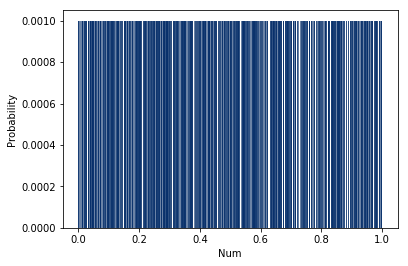
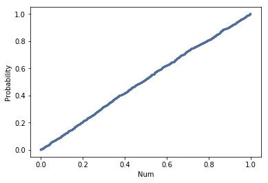

# [Think Stats Chapter 4 Exercise 2](http://greenteapress.com/thinkstats2/html/thinkstats2005.html#toc41) (a random distribution)

This questions asks you to examine the function that produces random numbers. Is it really random? A good way to test that is to examine the pmf and cdf of the list of random numbers and visualize the distribution. If you're not sure what pmf is, read more about it in Chapter 3.

The numbers generated by random.random are supposed to be uniform between 0 and 1; that is, every value in the range should have the same probability.
Generate 1000 numbers from random.random and plot their PMF and CDF.
Is the distribution uniform?

## Response

```python
import numpy as np
rand_nums = np.random.random(1000)
rand_pmf = thinkstats2.Pmf(rand_nums)

# Plot PMF of 1000 random numbers betwen 0 and 1
thinkplot.Hist(rand_pmf, width=0.0025)
thinkplot.Config(xlabel='Num', ylabel='Probability')
```



While the PMF gives the appearance of a uniform distribution, it's clear that how it's displayed is hugely dependent on the width of the bins. The default value will make the PMF render as if there's no data at all, and choices between 0.001 and 0.01 are suggestive of a uniform distribution but leave a lot to be desired. Let's check out the CDF. 

```python
rand_cdf = thinkstats2.Cdf(rand_nums)

# Plot CDF of 1000 random numbers betwen 0 and 1
thinkplot.Cdf(rand_cdf)
thinkplot.Config(xlabel='Num', ylabel='Probability')
```



Based on how linear the cdf is, it's fair to say that the distribution of random numbers is quite uniform.